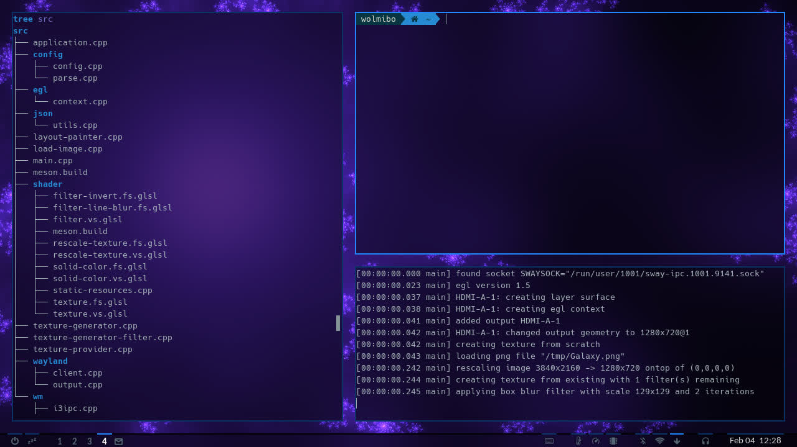

# WallpaBlur

Wallpaper provider which fakes window blur on Wayland based, i3ipc-enabled window
managers like [Sway](https://swaywm.org).



# Overview

WallpaBlur draws two background images per output:
 * a *wallpaper* on the empty desktop
 * a *background* behind windows

The `GET_TREE` command from i3ipc is then used to decide which image to draw in what
regions of the output.

## Why Does WallpaBlur Exist?

Sway does not support window blur and this is
[unlikely to change](https://github.com/swaywm/sway/issues/453).
WallpaBlur enables the most basic window blur effect in combination with upstream Sway.

## Supported Features

* multi-monitor support including monitor hot-plugging and individual configuration
* output scaling
* *wallpaper* and *background* can be chosen independently
* built-in effects:
  - box-blur (which can be iterated for a "fast gaussian" blur)
  - color inversion
* (optional) alpha fade-in and fade-out on startup and `SIGTERM`, respectively

## Limitations

* since WallpaBlur is not part of the compositor's pipeline, there is an unavoidable
  delay (one or two frames at 60Hz) whenever the window layout changes --
  depending on the visual differences between *wallpaper* and *background* this
  **can lead to screen flashing**
* obviously, there are no effects applied when windows are stacked on top of each other
* layer surfaces
  (used for status bars, notifications, application launchers, etc.)
  are not exposed via i3ipc and can currently only be added statically via the
  configuration
* resizing windows and moving floating windows are not provided as events through
  the i3ipc, for these cases `GET_TREE` must be called in frequent intervals


# Getting Started

## Dependencies

To build WallpaBlur you will need:
* GCC C++ 12 or newer
* [meson](https://mesonbuild.com)
* wayland development libraries
* [libepoxy](https://github.com/anholt/libepoxy)
* [rapidjson](https://rapidjson.org)
* [gdk-pixbuf](https://gitlab.gnome.org/GNOME/gdk-pixbuf) (>= 2.32)
  or as fallback [libpng](http://www.libpng.org/pub/png/libpng.html)


If your compiler does not provide `std::format` you'll additionally need:
* [fmt](https://fmt.dev)

To install all dependencies on Fedora 37 run:
```sh
sudo dnf install gcc-g++ meson libepoxy-devel rapidjson-devel fmt-devel \
wayland-devel wayland-protocols-devel gdk-pixbuf2-devel
```

## Build Instructions
To install WallpaBlur run the following commands in the project's root directory:
```sh
meson build
meson compile -C build
sudo meson install -C build
```

## Try It Out

First, make sure there is no other background provider running
(when using `output ... bg` in Sway the background provider is `swaybg`).
Then execute:
```sh
wallpablur <path-to-image>
```

To add a status bar or changing other properties, check out how to
[configure WallpaBlur](doc/configuration.md).
